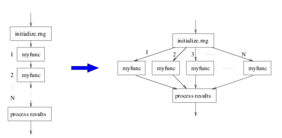
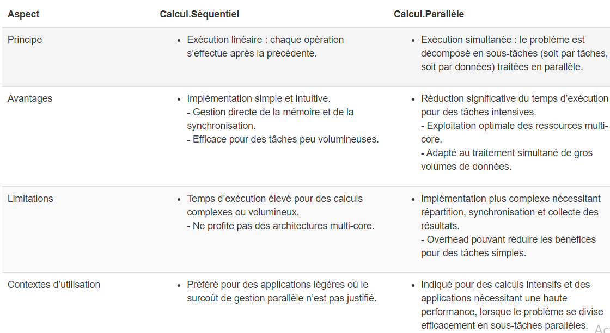

# Présentation du calcul parallele 

## Définition 

Le **calcul parallèle** désigne l'exécution simultanée de plusieurs tâches grâce à l'utilisation de plusieurs ressources informatiques (comme des cœurs ou des threads, dont nous parlerons ci-dessous). Plutôt que d’exécuter les opérations une par une (calcul séquentiel), le calcul parallèle divise un problème en sous-problèmes plus petits qui peuvent être résolus en même temps. Cette approche permet de réduire significativement le temps de traitement des tâches, surtout lorsque le problème est volumineux ou complexe.

`

## Comparaison calcul parallele vs calcul sequentielle 

`

## Types de parallélisme

Dans cette partie, nous explorons les types de parallélisme que l'on peut utiliser pour diviser une tâche complexe en plusieurs sous-tâches exécutées simultanément.

### Parallélisme des données vs parallélisme des taches 

#### Parallélisme de données

Le **parallélisme de données** consiste à prendre un même traitement et à l’appliquer **simultanément** à plusieurs **sous‑ensembles** d’un grand jeu de données.  
- **Principe** : on divise les données en morceaux indépendants (blocs de lignes, groupes de pays, plages horaires).  
- **Exécution** : chaque cœur (ou worker) reçoit un sous‑ensemble et réalise exactement la même opération (tri, somme, moyenne, etc.).  
- **Quand l’utiliser** :  
  - Traitement de **grandes bases de données** (Big Data)
  - Opérations répétitives et uniformes (ex. calcul de moyennes, transformations de colonnes)
  
- **Avantage** : excellente montée en charge dès que le volume de données est important, car chaque cœur peut travailler de son côté sans attendre les autres.

 **Application ** : Cette démonstration illustre simplement le principe du parallélisme des données en R. On génère un petit échantillon de 20 valeurs, que l’on divise en deux sous-ensembles traités en parallèle par deux cœurs. Chaque cœur calcule la moyenne de sa partie, puis on en déduit une moyenne globale. L’objectif ici n’est pas de gagner du temps — car sur un si petit échantillon, le parallélisme peut même être plus lent — mais simplement de comprendre le fonctionnement du parallélisme des données : création d’un cluster, répartition des données, traitement par cœur, et agrégation finale des résultats. 
 
```{r parallele_donnees, message=FALSE, warning=FALSE}

tictoc::tic.clearlog()    # Nettoyage des logs de tictoc

### Chargement des librairies nécessaires
library(parallel)         # Pour créer et gérer un cluster de workers
library(dplyr)            # Pour la manipulation de données
library(tictoc)           # Pour mesurer les temps d'exécution

### 1- Génération de l'échantillon

# Ceci permet la reproductibilité pour que lors de la reexecution ca ressorte les meme valeurs 
set.seed(42)

# Création d'un vecteur de 20 valeurs aléatoires
echantillon <- rnorm(n = 20, mean = 50, sd = 10)

# Affichage des valeurs
print(echantillon)

### 2- Calcul parallèle

# 2.1 Démarrage du chronomètre pour la phase parallèle
tic("Parallèle")  # "Parallèle est juste le nom du chronomètre lancé

# 2.2 Création d'un cluster de 2 workers
cluster <- makeCluster(2)

# 2.3 Division de l'échantillon en 2 sous-ensembles égaux
groupes <- split(echantillon, rep(1:2, each = 10))

# 2.4 Fonction de calcul de la moyenne (celle qui sera appliquée par chaque worker)
calcul_moyenne <- function(x) {
  mean(x)
}

# 2.5 Export des objets et fonction vers les workers
clusterExport(cluster, varlist = c("groupes", "calcul_moyenne"), envir = environment()) # Environnement sert à indiquer que les données se trouve dans l'environnement actuel

# 2.6 Exécution parallèle : chaque worker calcule la moyenne de son sous-ensemble
moyennes_partielles <- parLapply(cluster, groupes, calcul_moyenne) # Remember, parLapply prend le nom du cluster, les groupes et la fonction à appliquer 

# 2.7 Arrêt du cluster
tic.stop <- toc(log = TRUE) # Qui renvoie le temps executé par le chronomètre et stocke sa valeur 
stopCluster(cluster)

# 2.8 Affichage des moyennes calculées par chaque worker
names(moyennes_partielles) <- paste0("Cœur_", seq_along(moyennes_partielles)) # Juste pour numeroter les coeur et avoir coeur_1 et coeur_2
print(moyennes_partielles)

# 2.9 Calcul de la moyenne agrégée finale (moyenne des moyennes)
moyenne_parallele <- mean(unlist(moyennes_partielles))
print(paste("Moyenne agrégée (parallèle) :", round(moyenne_parallele, 4)))

### 3- Calcul séquentiel

# Démarrage du chronomètre pour la phase séquentielle
tic("Séquentiel")

# Calcul direct de la moyenne sur tout l'échantillon
moyenne_sequentielle <- mean(echantillon)

# Arrêt du chronomètre
toc(log = TRUE)

# Affichage du résultat séquentiel
print(paste("Moyenne (séquentielle) :", round(moyenne_sequentielle, 4)))
```

### Parallélisme de tâches

Le **parallélisme de tâches** consiste à exécuter **différentes opérations** en même temps, sur un même ou plusieurs jeux de données.  
- **Principe** : on définit plusieurs tâches **distinctes** (nettoyage, calcul de statistiques, visualisation, export), puis on les lance **en parallèle**.  
- **Exécution** : chaque worker prend en charge une tâche spécifique, sans interférer avec les autres.  
- **Quand l’utiliser** :  
  - Chaînes de traitement où chaque étape est indépendante  
  - Workflows complexes (prétraitement, analyse, génération de rapports)  
- **Avantage** : accélère l’exécution globale d’un pipeline en répartissant des opérations hétérogènes sur plusieurs ressources.

**Exemple*:
Une tâche fait le nettoyage des données, une autre effectue une analyse statistique, et une autre génère des graphiques. Ces trois tâches sont effectuées en parallèle.

**Application:** Exécuter en parallèle quatre traitements différents sur les données de navires : 1 worker pour calculer la moyenne de la vitesse moyenne par type de navire, 1 worker pour effectuer une regression linéaire entre la vitesse et la longueur des navires et ressortir les coefficients, un autre qui calcule les quantiles, enfin un dernier pour calculer l'écart type.

```{r parallelisme_taches, warning=FALSE, message=FALSE}

# Chargement des librairies
library(parallel)
library(dplyr)
library(readr)
library(tictoc)

# Chargement des données (silence sur les specs)
ships <- read_csv("Donnees/ships.csv", show_col_types = FALSE)

# Filtrer valeurs de SPEED et LENGTH valides
donnees <- ships %>% filter(!is.na(SPEED), SPEED > 0, !is.na(LENGTH))

# Définition des 4 tâches
#   1) moyenne de SPEED
#   2) écart-type de SPEED
#   3) coefficients de la régression SPEED ~ LENGTH
#   4) quantiles de SPEED (10%,25%,50%,75%,90%)

taches <- list(
  moyenne_speed = function(df) {
    mean(df$SPEED, na.rm = TRUE)
  },
  sd_speed = function(df) {
    sd(df$SPEED, na.rm = TRUE)
  },
  regression_speed_length = function(df) {
    coef(lm(SPEED ~ LENGTH, data = df))
  },
  quantiles_speed = function(df) {
    quantile(df$SPEED, probs = c(0.10, 0.25, 0.50, 0.75, 0.90), na.rm = TRUE)
  }
)

# Nombre de workers = 4
n_workers <- length(taches) #On fait ainsi au cas où modifie le nombre de taches plutard

# 1. Exécution parallèle
tic.clearlog() # Nettoyage des logs de tictoc
tic("Parallèle")
cl <- makeCluster(n_workers)
clusterExport(cl, c("donnees", "taches"), envir = environment())
invisible(clusterEvalQ(cl, suppressMessages(library(dplyr))))
res_parallel <- parLapply(cl, taches, function(f) f(donnees))
stopCluster(cl)
toc(log = TRUE)

# 2. Affichage des résultats
cat("\n-- Résultats Parallèle --\n")
for (n in names(res_parallel)) {
  cat(n, ":\n")
  print(res_parallel[[n]])
}

```

Pour le parallelisme de taches, il est généralement conseillé de **fixer le nombre de workers au plus égale nombre de cœurs physiques** de votre machine:

En effet, dans le cas où on a **Plus de workers que de cœurs**, même si l'hyper‑threading permet à un cœur de traiter plusieurs tâches simultanément, les threads d'un même cœur **partagent les mêmes ressources**.  
  Ainsi, lorsque plusieurs tâches lourdes sont exécutées en même temps et qu’un même cœur doit se les partager, il doit diviser ses ressources (comme le temps de calcul) entre elles. Cela crée une forme d’encombrement, ce qu’on appelle une congestion, qui ralentit l’exécution des tâches à cause de la compétition entre les workers pour accéder aux ressources, et de la surcharge liée à leur gestion.

En parallélisme de données, le nombre de workers doit être proche du nombre de cœurs physiques pour les calculs lourds. Si les tâches sont rapides, on peut augmenter les workers, mais de maniere prudente. 

## Parallélisme distribué et parallélisme partagé 

Il existe deux principales approches pour utiliser plusieurs processeurs afin de faire du calcul parallèle : le parallélisme distribué et le parallélisme partagé (ou calcul parallele en local). Ces approches déterminent comment les ressources sont partagées entre plusieurs processeurs, qu'ils soient dans un même ordinateur ou répartis sur plusieurs machines.

Le *parallélisme partagé* est basé sur le fait que tous les workers accèdent à la même mémoire centrale RAM.
C'est le modèle utilisé **lorsqu'on travaille sur une seule machine**, équipée de plusieurs cœurs de processeur.

D'autre part, le *parallélisme distribué* va plus loin en répartissant le calcul sur plusieurs machines connectées par un réseau. Chaque machine travaille sur une portion des données et communique avec les autres machines pour échanger des informations ou combiner les résultats. Dans ce cas, chaque machine peut avoir sa propre mémoire et ses propres ressources, et elles doivent s'échanger des données via un réseau (comme Internet ou un réseau local).
