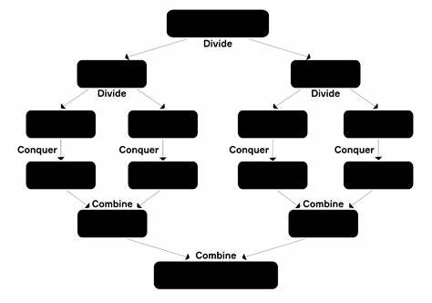

# Introduction

## 1- Contexte et motivations ayant donné lieu au calcul parallele

L’ère du Big Data, marquée par l’explosion des réseaux sociaux, de l’IoT (Internet des Objets), et des simulations numériques, a entraîné une croissance vertigineuse des données. Selon IBM, 90 % des données mondiales ont été générées au cours des deux dernières années seulement – un rythme qui s’accélère avec plus de 2,5 trillions d’octets créés quotidiennement (https://bernardmarr.com/how-much-data-do-we-create-every-day-the-mind-blowing-stats-everyone-should-read/.

Les applications critiques comme l’analyse financière en temps réel, l’entraînement de modèles de Deep Learning (ex : GPT-4 avec 1,7 trillion de paramètres), ou les prévisions météorologiques à haute résolution, exigent désormais des traitements en millisecondes. Or, un processeur monocœur classique ne peut traiter qu’environ 3 milliards d’instructions par seconde (3 GHz), rendant le calcul séquentiel totalement inadapté à ces défis.

## 2- Loi de Moore et plafonnement des fréquences CPU 

Les processeurs modernes reposent sur des milliards de transistors, des micro-interrupteurs qui exécutent des calculs. Selon la loi de Moore (1965), leur nombre double tous les deux ans, permettant pendant des décennies d’augmenter la fréquence d’horloge (GHz), c’est-à-dire le rythme auquel ces transistors s’activent. Ainsi, un CPU à 3 GHz réalise 3 milliards d’opérations par seconde. Cependant, au-delà de ~4 GHz, la chaleur et la consommation d’énergie deviennent ingérables. 

Pour contourner cette limite, l’industrie a abandonné l’idée d’un cœur unique ultra-rapide et a opté pour le multi-core en ajoutant plusieurs cœurs sur une même puce.Chacun fonctionne à une fréquence raisonnable, mais leur travail combiné permet de traiter des tâches en parallèle. Surtout, le multi-core répartit la chaleur sur toute la surface du CPU, évitant les points chauds et facilitant le travail des systèmes de refroidissement (ventilateurs, radiateurs). Cette approche est aujourd’hui indispensable pour le Big Data ou l’apprentissage automatique, où des milliards de données doivent être traitées sans surchauffer les machines.

# Présentation du calcul parallele 

## Définition 

Le **calcul parallèle** désigne l'exécution simultanée de plusieurs tâches grâce à l'utilisation de plusieurs ressources informatiques (comme des cœurs ou des threads, dont nous parlerons ci-dessous). Plutôt que d’exécuter les opérations une par une (calcul séquentiel), le calcul parallèle divise un problème en sous-problèmes plus petits qui peuvent être résolus en même temps. Cette approche permet de réduire significativement le temps de traitement des tâches, surtout lorsque le problème est volumineux ou complexe.

`

## Comparaison calcul parallele vs calcul sequentielle 

`

## Types de parallélisme

Dans cette partie, nous explorons les types de parallélisme que l'on peut utiliser pour diviser une tâche complexe en plusieurs sous-tâches exécutées simultanément.

### Parallélisme des données vs paralléliste des taches 

#### Parallélisme de données

Le **parallélisme de données** consiste à prendre un même traitement et à l’appliquer **simultanément** à plusieurs **sous‑ensembles** d’un grand jeu de données.  
- **Principe** : on divise les données en morceaux indépendants (blocs de lignes, groupes de pays, plages horaires).  
- **Exécution** : chaque cœur (ou worker) reçoit un sous‑ensemble et réalise exactement la même opération (tri, somme, moyenne, etc.).  
- **Quand l’utiliser** :  
  - Traitement de **grandes bases de données** (Big Data)
  - Opérations répétitives et uniformes (ex. calcul de moyennes, transformations de colonnes)
  
- **Avantage** : excellente montée en charge dès que le volume de données est important, car chaque cœur peut travailler de son côté sans attendre les autres.

 **Application ** : Cette démonstration illustre simplement le principe du parallélisme des données en R. On génère un petit échantillon de 20 valeurs, que l’on divise en deux sous-ensembles traités en parallèle par deux cœurs. Chaque cœur calcule la moyenne de sa partie, puis on en déduit une moyenne globale. L’objectif ici n’est pas de gagner du temps — car sur un si petit échantillon, le parallélisme peut même être plus lent — mais simplement de comprendre le fonctionnement du parallélisme des données : création d’un cluster, répartition des données, traitement par cœur, et agrégation finale des résultats. 
 
```{r parallele_donnees, message=FALSE, warning=FALSE}

tictoc::tic.clearlog()    # Nettoyage des logs de tictoc

### Chargement des librairies nécessaires
library(parallel)         # Pour créer et gérer un cluster de workers
library(dplyr)            # Pour la manipulation de données
library(tictoc)           # Pour mesurer les temps d'exécution

### 1- Génération de l'échantillon

# Ceci permet la reproductibilité pour que lors de la reexecution ca ressorte les meme valeurs 
set.seed(42)

# Création d'un vecteur de 20 valeurs aléatoires
echantillon <- rnorm(n = 20, mean = 50, sd = 10)

# Affichage des valeurs
print(echantillon)

### 2- Calcul parallèle

# 2.1 Démarrage du chronomètre pour la phase parallèle
tic("Parallèle")  # "Parallèle est juste le nom du chronomètre lancé

# 2.2 Création d'un cluster de 2 workers
cluster <- makeCluster(2)

# 2.3 Division de l'échantillon en 2 sous-ensembles égaux
groupes <- split(echantillon, rep(1:2, each = 10))

# 2.4 Fonction de calcul de la moyenne (celle qui sera appliquée par chaque worker)
calcul_moyenne <- function(x) {
  mean(x)
}

# 2.5 Export des objets et fonction vers les workers
clusterExport(cluster, varlist = c("groupes", "calcul_moyenne"), envir = environment()) # Environnement sert à indiquer que les données se trouve dans l'environnement actuel

# 2.6 Exécution parallèle : chaque worker calcule la moyenne de son sous-ensemble
moyennes_partielles <- parLapply(cluster, groupes, calcul_moyenne) # Remember, parLapply prend le nom du cluster, les groupes et la fonction à appliquer 

# 2.7 Arrêt du cluster
tic.stop <- toc(log = TRUE) # Qui renvoie le temps executé par le chronomètre et stocke sa valeur 
stopCluster(cluster)

# 2.8 Affichage des moyennes calculées par chaque worker
names(moyennes_partielles) <- paste0("Cœur_", seq_along(moyennes_partielles)) # Juste pour numeroter les coeur et avoir coeur_1 et coeur_2
print(moyennes_partielles)

# 2.9 Calcul de la moyenne agrégée finale (moyenne des moyennes)
moyenne_parallele <- mean(unlist(moyennes_partielles))
print(paste("Moyenne agrégée (parallèle) :", round(moyenne_parallele, 4)))

### 3- Calcul séquentiel

# Démarrage du chronomètre pour la phase séquentielle
tic("Séquentiel")

# Calcul direct de la moyenne sur tout l'échantillon
moyenne_sequentielle <- mean(echantillon)

# Arrêt du chronomètre
toc(log = TRUE)

# Affichage du résultat séquentiel
print(paste("Moyenne (séquentielle) :", round(moyenne_sequentielle, 4)))
```

### Parallélisme de tâches

Le **parallélisme de tâches** consiste à exécuter **différentes opérations** en même temps, sur un même ou plusieurs jeux de données.  
- **Principe** : on définit plusieurs tâches **distinctes** (nettoyage, calcul de statistiques, visualisation, export), puis on les lance **en parallèle**.  
- **Exécution** : chaque worker prend en charge une tâche spécifique, sans interférer avec les autres.  
- **Quand l’utiliser** :  
  - Chaînes de traitement où chaque étape est indépendante  
  - Workflows complexes (prétraitement, analyse, génération de rapports)  
- **Avantage** : accélère l’exécution globale d’un pipeline en répartissant des opérations hétérogènes sur plusieurs ressources.

**Exemple*:
Une tâche fait le nettoyage des données, une autre effectue une analyse statistique, et une autre génère des graphiques. Ces trois tâches sont effectuées en parallèle.

**Application:** Exécuter en parallèle quatre traitements différents sur les données de navires : 1 worker pour calculer la moyenne de la vitesse moyenne par type de navire, 1 worker pour effectuer une regression linéaire entre la vitesse et la longueur des navires et ressortir les coefficients, un autre qui calcule les quantiles, enfin un dernier pour calculer l'écart type.

```{r parallelisme_taches, warning=FALSE, message=FALSE}

# Chargement des librairies
library(parallel)
library(dplyr)
library(readr)
library(tictoc)

# Chargement des données (silence sur les specs)
ships <- read_csv("Donnees/ships.csv", show_col_types = FALSE)

# Filtrer valeurs de SPEED et LENGTH valides
donnees <- ships %>% filter(!is.na(SPEED), SPEED > 0, !is.na(LENGTH))

# Définition des 4 tâches
#   1) moyenne de SPEED
#   2) écart-type de SPEED
#   3) coefficients de la régression SPEED ~ LENGTH
#   4) quantiles de SPEED (10%,25%,50%,75%,90%)

taches <- list(
  moyenne_speed = function(df) {
    mean(df$SPEED, na.rm = TRUE)
  },
  sd_speed = function(df) {
    sd(df$SPEED, na.rm = TRUE)
  },
  regression_speed_length = function(df) {
    coef(lm(SPEED ~ LENGTH, data = df))
  },
  quantiles_speed = function(df) {
    quantile(df$SPEED, probs = c(0.10, 0.25, 0.50, 0.75, 0.90), na.rm = TRUE)
  }
)

# Nombre de workers = 4
n_workers <- length(taches) #On fait ainsi au cas où modifie le nombre de taches plutard

# 1. Exécution parallèle
tic.clearlog() # Nettoyage des logs de tictoc
tic("Parallèle")
cl <- makeCluster(n_workers)
clusterExport(cl, c("donnees", "taches"), envir = environment())
invisible(clusterEvalQ(cl, suppressMessages(library(dplyr))))
res_parallel <- parLapply(cl, taches, function(f) f(donnees))
stopCluster(cl)
toc(log = TRUE)

# 2. Affichage des résultats
cat("\n-- Résultats Parallèle --\n")
for (n in names(res_parallel)) {
  cat(n, ":\n")
  print(res_parallel[[n]])
}

```

Pour le parallelisme de taches, il est généralement conseillé de **fixer le nombre de workers au plus égale nombre de cœurs physiques** de votre machine:

En effet, dans le cas où on a **Plus de workers que de cœurs**, même si l'hyper‑threading permet à un cœur de traiter plusieurs tâches simultanément, les threads d'un même cœur **partagent les mêmes ressources**.  
  Ainsi, lorsque plusieurs tâches lourdes sont exécutées en même temps et qu’un même cœur doit se les partager, il doit diviser ses ressources (comme le temps de calcul) entre elles. Cela crée une forme d’encombrement, ce qu’on appelle une congestion, qui ralentit l’exécution des tâches à cause de la compétition entre les workers pour accéder aux ressources, et de la surcharge liée à leur gestion.

En parallélisme de données, le nombre de workers doit être proche du nombre de cœurs physiques pour les calculs lourds. Si les tâches sont rapides, on peut augmenter les workers, mais de maniere prudente. 

## Parallélisme distribué et parallélisme partagé 

Il existe deux principales approches pour utiliser plusieurs processeurs afin de faire du calcul parallèle : le parallélisme distribué et le parallélisme partagé (ou calcul parallele en local). Ces approches déterminent comment les ressources sont partagées entre plusieurs processeurs, qu'ils soient dans un même ordinateur ou répartis sur plusieurs machines.

Le *parallélisme partagé* est basé sur le fait que tous les workers accèdent à la même mémoire centrale RAM.
C'est le modèle utilisé **lorsqu'on travaille sur une seule machine**, équipée de plusieurs cœurs de processeur.

D'autre part, le *parallélisme distribué* va plus loin en répartissant le calcul sur plusieurs machines connectées par un réseau. Chaque machine travaille sur une portion des données et communique avec les autres machines pour échanger des informations ou combiner les résultats. Dans ce cas, chaque machine peut avoir sa propre mémoire et ses propres ressources, et elles doivent s'échanger des données via un réseau (comme Internet ou un réseau local).

# Concepts fondamentaux 

Le processeur (ou CPU, pour Central Processing Unit) est la partie qui exécute les instructions des programmes et effectue les calculs nécessaires au bon fonctionnement de l'ordinateur. Il peut être vu comme "l'organe" qui contrôle l'exécution des tâches. Un processeur peut contenir un ou plusieurs cœurs (ou cores), chacun capable de traiter des instructions indépendamment.

## Coeurs du Processeur

**Définition :**  
Un **cœur** (ou core) est une unité de calcul indépendante au sein d’un même processeur. Chaque cœur dispose de son propre jeu de registres, d’une unité arithmétique/logique et d’un cache. Plus un processeur compte de cœurs, plus il peut traiter de tâches vraiment en parallèle. 

- **Exemple :**  
  Un processeur *quad-core* possède 4 coeurs physiques, chacun pouvant exécuter des instructions indépendamment des autres.

- Par ailleurs, il ne faut pas se fier aux noms marketing: un Intel Core i5 n’a pas nécessairement 5 coeurs ! Par exemple, un i5-10400 possède 6 coeurs physiques. Les nombres dans les noms (i3, i5, i7) reflètent une gamme de performance, pas le nombre de coeurs.

- Pour connaître le nombre de coeurs disponibles sur votre machine, vous pouvez utiliser la fonction `detectCores()` du package **parallel**, avec l'option FALSE sur logical. 

```{r coeurs, message=FALSE, warning=FALSE }
# Ce package n'a pas besoin d'être téléchargé au préalable,
# il est directement disponible lorsque R est installé 
library(parallel) 

# Nombre de coeurs physiques
nb_coeurs_physiques <- detectCores(logical = FALSE)
print(nb_coeurs_physiques)
``` 

Dans mon cas par exemple, mon core i5 a 10 coeurs.

## Threads (ou Processeurs Logiques)

- **Définition :**  
Un **thread** est la plus petite unité d’exécution gérée par le système d’exploitation, c’est une séquence d’instructions qu’un cœur peut traiter.

Chaque thread possède son propre contexte (ensemble des informations que le CPU doit sauvegarder et restaurer pour reprendre l’exécution exactement là où il s’était arrêté), mais partage avec les autres threads du même cœur les ressources matérielles (unités arithmétiques, caches).

- Pour connaître le nombre de threads disponibles sur votre machine, vous pouvez utiliser la même fonction `detectCores()` du package **parallel**, avec l'option TRUE sur logical. 

```{r threads, message=FALSE, warning=FALSE}
# Nombre de threads (unités logiques)
nb_threads <- detectCores(logical = TRUE)
print(nb_threads)
``` 

Ces deux informations peuvent aussi etre visualisées au niveau du gestionnaire de tâches, sous l'onglet performance.


## Hyper-threading  
  C'est une technologie qui permet à un seul cœur physique de se présenter au système d'exploitation comme deux (et quelque fois plus de 2) cœurs logiques (threads) simultanés.  
  
  - **Exemple :**  
    Un processeur quad-core sans hyper-threading gère 4 threads mais lorsqu'il est  doté d'hyper-threading, il peut gérer 8 threads. De manière generale le système d'exploitation considere donc que l'ordinateur a 8 coeurs puisqu'il peut théoriquement exécuter 8 tâches en même temps, mais en réalité, c'est rien que 4 coeurs physiques qui existent réellement. 

### Lien entre Coeurs, Threads et calcul parallele

- **Physiquement :**  
  Vous disposez d'un nombre fixe de coeurs physiques (par exemple, 4 coeurs sur un processeur quad-core).
  
- **Logiquement :**  
  Chaque coeur peut être "dédoublé" en plusieurs threads grâce à l'hyper-threading. Ainsi, même avec 4 coeurs, vous pouvez avoir plus d'unités d'exécution simultanée (par exemple, 8 threads).

- **En pratique pour le calcul parallèle :**  
  On parle souvent de "coeurs" pour simplifier, mais ce sont en réalité les **threads** (unités logiques) qui exécutent les tâches. Le nombre de threads disponibles détermine combien de tâches peuvent être réellement exécutées en parallèle.

Par exemple, dans mon cas, mon ordinateur a 10 coeurs et 12 threads et donc il y a 2 coeurs qui grace au hyper-threading gerent 2 threads chacun et les 8 autres coeurs gerent 1 thread chacun. Donc pour le calcul parallele, 12 threads sont disponibles pour optimiser cette méthode.

## Programme Maître et son rôle dans le calcul parallèle

Le programme maître est essentiel pour coordonner le calcul parallèle en distribuant les tâches et en recueillant les résultats. Il est chargé de trois responsabilités principales :

1. **Initialisation des workers**  

   - Création des workers et chargement des packages nécessaires. 
   
   - **Coût d’initialisation** : cette étape peut prendre plusieurs secondes, car chaque worker doit démarrer et recevoir les outils nécessaires.  
    
   - **Amortissement de l'overhead** : pour que le parallélisme soit rentable, chaque worker doit avoir **suffisamment de travail** pour compenser ce temps de démarrage, dans le cas contraire, le calcul séquentiel peut etre preferable. 
     
   - *Exemple*: Si le démarrage d’un worker prend 100 ms et que sa tâche dure 10 ms, le coût d’overhead est prohibitif. 
( L’**overhead** ou **surcharge** regroupe toutes les opérations **hors calcul** qui consomment du temps:
- Création et destruction des workers  
- Exportation des données et des fonctions  
- Chargement des packages  
- Communication entre le maître et les workers  
Ces coûts doivent être **compensés** par la durée des calculs parallèles pour que l’approche soit bénéfique.)

2. **Répartition des tâches:**  

Le programme maître divise une tâche globale en plusieurs sous-tâches qui peuvent être exécutées simultanément par différents threads ou cœurs de processeur. L'objectif est de distribuer la charge de travail pour maximiser l'efficacité de l'exécution parallèle.
Ainsi, chaque thread travaille sur une portion de la tâche, ce qui accélère l'exécution du programme.

3. **Lancement en parallèle:**  

Une fois que les sous-tâches sont réparties, le programme maître envoie chaque sous-tâche aux threads disponibles pour exécution simultanée. Ces threads peuvent être répartis sur les différents cœurs de processeur ou machines.

- **Collecte et agrégation des résultats:**  
Après que chaque thread a terminé sa partie du travail, le programme maître récupère les résultats produits. 

D'autres part, nous distinguons les sous-programmes (ou workers).

### Cluster et worker 

Un **cluster** est l’ensemble des processus R (ou threads) que l’on lance pour exécuter un calcul en parallèle.  
- On crée un cluster avec `makeCluster(n)`, où `n` est le nombre de workers souhaités.  
- Le cluster sert à **répartir** le travail sur plusieurs unités de calcul (cœurs ou machines).

Un **worker** est un **processus individuel** du cluster :  
- Il reçoit **une sous‑tâche** du programme maître.  
- Il exécute la fonction assignée sur son lot de données.
- Il renvoie son résultat au programme maître pour agrégation.

D'autre part, on distingue le **cluster** est un ensemble de processus R (ou de threads) lancés pour exécuter des tâches en parallèle.  
- Chaque processus du cluster est appelé un **worker**.  
- Le cluster permet de répartir le travail sur plusieurs unités de calcul (cœurs ou machines).

**Remarque**  
- On peut créer plus de workers que de threads logiques.
- Dans ce cas, les workers excédentaires restent en **attente** jusqu’à ce qu’un thread se libère.  
- Il faut veiller à ce que chaque worker ait **suffisamment** de travail pour amortir le coût de démarrage du cluster. 


-- Mise en oeuvre avec R (structure globale)

Les fonctions proviennent du package parallele aussi. 

Etape 1: on initialise un cluster, c’est-à-dire un groupe de workers, en précisant combien on en veut (par exemple, dans notre cas, on definit autant que le nombre de threads disponibles: **cl <- makeCluster(nb_threads)**).

Etape 2: Puis la fonction parLapply() permet de distribuer les sous-tâches à chaque worker. On lui donne une liste tâches  et une fonction f à appliquer à chaque élément. (**résultats <- parLapply(cl, tâches, f)**). 

Etape 3: Arrêt du cluster (libération des ressources): Une fois toutes les tâches terminées, on arrête proprement les workers.Cela libère la mémoire et évite de laisser des processus inutilisés tourner en arrière-plan. On fait de ce fait: **stopCluster**. 

Etape 4: Chaque worker renvoie un résultat (souvent un tableau ou un vecteur).On utilise une fonction pour assembler tous les résultats obtenus en un seul tableau cohérent, ligne par ligne.

# Packages et fonctions de base du calcul parallele

## 1. Package **parallel**

Ce package fait partie de l’installation standard de R et est utilisé pour répartir des tâches entre les cœurs d’un même ordinateur (et donc dans un parallélisme partagé). 

- `makeCluster(n)` : crée un cluster de `n` workers.
- `clusterExport(cl, varlist)` : exporte les objets R nécessaires aux workers dans leurs environnements respectifs.
- `clusterEvaLQ(cl, expr): 	Exécute une commande dans tous les workers
- `parLapply(cl, X, FUN)` : version parallèle de `lapply. La base de données ou tout autre objet X est divisé en sous ensemble qui seront traité par un worker différent du cluster cl et chaque worker applique la fonction FUN a chaque élément à sa charge. Et à la fin les résultats sont présentés sous forme de liste. 
- `parSapply(cl, X, FUN)` : Meme principe que parLapply mais ici le résultat est simplifié et n'est pas forcément sous forme d'une liste. 
- `stopCluster(cl)` : arrête le cluster.
- `clusterApply()`  : applique la fonction fun sur les éléments de x, chaque élément étant envoyé à un worker du cluster cl.

parLappy, parMapply sont les versions paralleles de lapply et sapply respectivement. 
(lapply applique une fonction à chaque élément d'une liste ou d'un vecteur et renvoie une liste de résultats, tandis que sapply fait pareil mais mais essaie de simplifier la réponse et, il renvoie un vecteur au lieu d'une liste (si tous les résultats sont du même type).)

Un exemple d'application des fonctions de ce package est ce qui est fait dans l'application du fork-join.

## 2. Package **tictoc** 

Ce package mesure le temps que prend une tâche à s'exécuter.
Ses fonctions clé sont: 
- `tic(label)`: Pour lancer le chronomètre , le label étant optionnel et servant à identifier le chronometre.   
- `toc`: Arrête le chronometre et affiche le temps écoulé 

## 3. Package **foreach + doParallel** 

Ces packages permettent de créer des boucles parallèles. foreach fournit la syntaxe, tandis que doParallel permet de connecter cette syntaxe à un backend de calcul parallèle (comme un cluster).er.

Ses principales fonctions sont: 
- `registerDoParallel(n)`: crée un cluster de `n` workers pour exécuter des boucles en parallèle.
- `foreach()`: Permet d'itérer de manière parallèle sur une séquence donnée.
- `%dopar%`: L'opérateur utilisé avec foreach pour paralléliser l'exécution de la boucle (en remplacement de %do%) .

```{r foreach_doParallel, message=FALSE, warning=FALSE}
library(foreach)
library(doParallel)

# Création du cluster pour l'execution des boucles en paralleles
registerDoParallel(2)

resultats <- foreach(i = 1:20) %dopar% sqrt(i)
print(resultats)
``` 
Ici, le calcul de racines carrées est réparti entre 2 cœurs. 

## 4. Packages **future** et **future.apply**

Les packages `future` et `future.apply` ont été conçus pour rendre le calcul parallèle en R à la fois plus simple, plus lisible et plus flexible. Contrairement à des packages comme `parallel`, où il faut explicitement créer un cluster, gérer les workers et exporter les variables, ici on adopte une approche déclarative : **on décrit ce qu’on veut faire**, et **le système se charge de l’exécuter** selon un plan défini.

Ces packages permettent de paralléliser facilement des fonctions comme `lapply()` ou `sapply()` **sans avoir à se soucier des aspects techniques** (gestion des cœurs, communication entre workers, etc.). Il devient ainsi très simple de basculer d'une exécution séquentielle à une exécution parallèle, en changeant une seule ligne de code.

Ses principales fonctions sont: 

- `plan(strategy)`  
  Cette fonction définit le **plan d’exécution**, c’est-à-dire la manière dont les tâches vont être exécutées :
  - `plan(sequential)` : exécution séquentielle classique, une tâche après l'autre (par défaut).
  - `plan(multisession)` : exécution parallèle sur plusieurs cœurs, chaque tâche étant lancée dans un processus indépendant. Fonctionne sur **tous les systèmes d’exploitation**, y compris **Windows**.
  - `plan(multicore)` : exécution parallèle optimisée pour **Linux/Mac** uniquement.

- `future_lapply(X, FUN)`  
  Version parallèle de `lapply()`. Chaque élément de `X` est traité indépendamment par la fonction `FUN`, de manière simultanée sur les différents cœurs disponibles. Le résultat est retourné sous forme de **liste**.

- `future_sapply(X, FUN)`  
  Version parallèle de `sapply()`. Fonctionne comme `future_lapply()` mais **le résultat est automatiquement simplifié** (vecteur, matrice...), comme avec `sapply()`.

```{r future, message=FALSE, warning=FALSE}

library(future)
library(future.apply)

# Définir le plan d'exécution parallèle
plan(multisession)  # Utiliser plusieurs cœurs sur tous les systèmes d'exploitation

# Créer une liste de nombres
x <- 1:10

# Appliquer une fonction de manière parallèle
resultats <- future_lapply(x, function(i) sqrt(i))

# Afficher les résultats
print(resultats)
```

## 5. Package **snow** (Simple Network of Workstations)

**snow** est une alternative plus flexible à parallel, notamment pour les environnements distribués (plusieurs machines), mais fonctionne aussi en local. 

Il comporte les fonctions suivantes: 

- `makeCluster()`: crée un cluster de workers, localement ou à distance.

- `clusterExport()`: clusterApply(), clusterMap(): mêmes principes que dans parallel.

- `snow.time()`: mesure le temps d'exécution d’une commande dans un cluster.


## 6. Package **snowFT** 
**snowFT** est une extension du package snow permettant la tolérance aux pannes (fault tolerance). Il est utile dans les environnements instables ou avec de longs calculs, car il permet de redémarrer un worker qui a échoué sans compromettre tout le processus.

Ici `makeClusterFT()`: crée un cluster avec tolérance aux pannes.
Compatible avec les fonctions classiques de snow.

# Patterns essentiels 

## Fork-join

**Principe :**  
On découpe une tâche en plusieurs sous‑tâches indépendantes (fork), on exécute ces sous‑tâches simultanément sur plusieurs cœurs, puis on combine (join) leurs résultats pour produire la réponse finale.

**Étapes :**  
1. **Fork** : création de sous‑tâches à partir de la tâche principale.  
2. **Exécution parallèle** : chaque sous‑tâche s’exécute sur un cœur distinct.  
3. **Join** : agrégation des résultats partiels pour reconstituer la solution complète.

`

Exemple d'application: nous avons utilisé le package parallel pour diviser la tâche de calcul de la moyenne de la variable SPEED du jeu de données ships en plusieurs sous-tâches exécutées simultanément sur plusieurs cœurs. Chaque cœur effectue un calcul partiel de la moyenne, et les résultats obtenus sont affichés pour chaque cœur avant l'agrégation finale. 

```{r fork-join, echo=TRUE, message=FALSE, warning=FALSE}

library(readr)
library(dplyr)
library(parallel)
library(tictoc)

ships <- readr::read_csv("Donnees/ships.csv", show_col_types = FALSE) # Pour ne pas afficher les infos sur les colonnes

# Étape 1 : Préparation des données (données sans valeurs manquantes)
donnees_filtrees <- ships %>%
  filter(!is.na(SPEED), SPEED > 0)

# Étape 2 : Définition de la fonction
tache_moyenne <- function(data) {
  mean(data$SPEED, na.rm = TRUE)
}

# Étape 3 : Configuration du cluster pour 3 workers
  cl <- makeCluster(2)

# Exportation des données et fonction vers chaque worker
clusterExport(cl, c("donnees_filtrees", "tache_moyenne"))
invisible(clusterEvalQ(cl, suppressMessages(library(dplyr)))) # Juste pour désactiver les messages pour les librairies


# Étape 4 : Exécution parallèle avec chronométrage
tic("Exécution en parallèle")
resultats_paralleles <- parLapply(cl, list(tache_moyenne), function(f) {
  res <- f(donnees_filtrees)  # Chaque worker calcule la moyenne de SPEED
  cat("Résultat du cœur :", res, "\n")  # Affiche le résultat de chaque cœur
  return(res)
})
toc()  # Chronomètre le temps d'exécution

# Étape 5 : Arrêt du cluster 
stopCluster(cl)

# Résultat parallèle
moyenne_parallele <- resultats_paralleles[[1]]
cat("Moyenne (calculée en parallèle) :", moyenne_parallele, "\n")

```

Ici la tache demandée n'est pas vraiment complexe d'où le gain de temps n'est pas important. 


## Map Reduce

(Dans le cas où nous avons des données numériques, le schéma MapReduce s’apparente à un modèle Fork and Join, car il n'est pas nécessaire de manipuler des paires clé-valeur.
Dans ce contexte, chaque worker traite simplement une portion des données, et les résultats sont ensuite agrégés directement.
Nous illustrerons ensuite le cas où les paires clé-valeur sont nécessaires, à travers un exemple avec des chaînes de caractères.)

Le modèle MapReduce est utilisé pour traiter de grandes quantités de données en parallèle, c'est-à-dire en les traitant simultanément, mais de manière organisée. Il consiste en 4 étapes principales : Division des données, Map, Shuffle (Regroupement) et Reduce.

`

**Étapes :**

1. **Division des données ** : Dans la phase de division, les données sont découpées en morceaux plus petits, pour un traitement plus rapide et facile. 

2. **Map ** : Une fois les données découpées, la phase Map entre en jeu. La fonction Map est appliquée à chaque morceau de données. Elle prend un morceau en entrée, le traite et génère des paires clé-valeur.La clé peut être n'importe quel identifiant ou valeur qui représente un élément spécifique du morceau de données. Par ailleurs, la valeur est un nombre qui représente l'information associée à cette clé. Dans beaucoup de cas, cette valeur est simplement un nombre 1, pour signifier que l'élément a été trouvé ou observé une fois. 

3. **Shuffle **: Une fois les paires clé-valeur générées, il est temps de les regrouper pour les préparer à la phase Reduce. Elle consiste à regrouper toutes les paires ayant la même clé ensemble.

4. **Reduce **: La phase Reduce consiste à agréger les données regroupées par la phase Shuffle. Pour chaque groupe de paires ayant la même clé, une fonction Reduce est appliquée pour combiner ou résumer les valeurs.

**Exemple 1 :** Comptage des fréquences de chaque mot dans un texte 

```{r map-reduce1, echo=TRUE, message=FALSE, warning=FALSE}

library(tictoc)


# Charger les librairies nécessaires
suppressPackageStartupMessages({
  library(parallel)
})

# Texte à analyser 
phrases <- c(
  "Le chat mange le poisson",
  "Le chien court après le chat",
  "Le poisson nage dans l'eau"
)

# --- Phase MAP ---
map_function <- function(phrase) {
  # Découpage de la phrase en mots (clés)
  mots <- unlist(strsplit(tolower(phrase), "\\W+"))  # Ignorer la casse et la ponctuation
  # Génération des couples (mot, 1)
  return(data.frame(mot = mots, valeur = 1))
}

# --- Phase REDUCE ---
reduce_function <- function(cles, valeurs) {
  # Agrégation : somme des valeurs par clé
  aggregate(valeur ~ mot, data = data.frame(mot = cles, valeur = valeurs), sum)
}

# Configuration du cluster (4 cœurs)
cl <- makeCluster(4)
clusterExport(cl, c("map_function", "reduce_function"))

# --- MAP ---
# Appliquer la fonction map à chaque phrase en parallèle
resultats_map <- parLapply(cl, phrases, map_function)

# --- SHUFFLE (Regroupement des clés) ---
# Combiner tous les résultats partiels
donnees <- do.call(rbind, resultats_map)

# --- REDUCE ---
# Appliquer la fonction reduce sur les données groupées
resultat_final <- reduce_function(donnees$mot, donnees$valeur)

# Arrêt du cluster
stopCluster(cl)

print(resultat_final)

```

## Divide & Conquer

**Principe :**  
On résout un problème en le divisant **récursivement** en sous‑problèmes plus petits, jusqu’à ce qu’ils soient assez simples pour être résolus directement. Ensuite, on **combine** les solutions de ces sous‑problèmes pour obtenir la solution du problème initial.

**Étapes :**  
1. **Diviser** : séparer le problème en deux (ou plusieurs) sous‑problèmes de taille réduite.  
2. **Conquer (Régner)** : résoudre chaque sous‑problème, éventuellement en réappliquant récursivement la même méthode, jusqu’à obtenir des sous‑listes de taille suffisamment petite pour être traitées simplement.  
3. **Combiner** : fusionner les solutions des sous‑problèmes pour former la solution finale.  

`

# PERFORMANCE ET ASPECTS PRATIQUES 

## Métriques de base 

### Speedup

Le speedup se définit comme le ratio du temps d'exécution d'une tâche en mode séquentiel (T₁) sur le temps en mode parallèle (Tₚ) :
$$
\text{Speedup} = \frac{T_1}{T_p}
$$
--- Speedup pour une tache légère (pour montrer que dans ce cas, le calcul parallele est plus couteux)

Ici on utilise une fonction qui calcule la somme des carrés des entiers de 1 à 10 000 suivant les methodes parallele et sequentielle. 

```{r speedup1, eval=FALSE, message=FALSE, warning=FALSE}

library(parallel)
library(tictoc)

# Fonction séquentielle
tache_sequentielle <- function(n = 1e4) {
  sum((1:n)^2)
}

# Fonction parallèle
tache_parallele <- function(n = 1e4, coeurs = 2) {
  cl <- makeCluster(coeurs)  # Création d'un cluster de travail avec un nombre spécifié de cœurs
  clusterExport(cl, varlist = "n")  # Exporter la variable 'n' dans les processus du cluster
  resultat <- parLapply(cl, split(1:n, cut(1:n, coeurs)), function(x) sum(x^2))  # Calcul parallèle des carrés, chaque sous-ensemble 'x' est traité sur un cœur
  stopCluster(cl)  # Arrêter le cluster une fois le calcul terminé
  Reduce("+", resultat)  # Agréger les résultats obtenus sur les différents cœurs
}

# Liste des cœurs à tester
liste_coeurs <- c(1, 2, 3, 4, 5, 6, 8)

# Initialisation du tableau des résultats
resultats_simples <- data.frame(Cœurs = liste_coeurs, Temps = NA, Speedup = NA)

# Temps de référence (séquentiel)
temps_seq <- system.time(tache_sequentielle())[3]

# Remplissage du tableau
for (i in seq_along(liste_coeurs)) {
  nb_coeurs <- liste_coeurs[i]
  
  if (nb_coeurs == 1) {
    resultats_simples$Temps[i] <- round(temps_seq, 4)
    resultats_simples$Speedup[i] <- 1
  } else {
    temps_par <- system.time(tache_parallele(1e4, nb_coeurs))[3]
    resultats_simples$Temps[i] <- round(temps_par, 4)
    resultats_simples$Speedup[i] <- round(temps_seq / temps_par, 2)
  }
}

# Affichage du tableau final
resultats_simples

```
En effet, on observe que la version séquentielle de la fonction prend environ 0,32 secondes, tandis que la version parallèle devient de plus en plus lente à mesure qu’on augmente le nombre de cœurs. Le tableau récapitulatif montre ainsi que le speedup est inférieur à 1 dans tous les cas, ce qui signifie qu’il n’y a aucun gain de performance – au contraire, l'exécution parallèle est plus lente. Cela s’explique par le coût de la création du cluster, de la répartition des données, et de la communication entre les cœurs, qui devient significatif face à une tâche aussi légère. Ces résultats montrent clairement que le parallélisme n’est pas avantageux pour les tâches simples. 

--- Speedup pour une tache complexe 

Produit matricielle de matrice de taille 1000*1000

Pour le calcul parallele, on donne des groupes de C_{ij} avec \[
C_{ij} = \sum_{k=1}^{n} A_{ik} \times B_{kj}
\] à différents coeurs pour les calculs. 

```{r speedup2,  eval=FALSE,message=FALSE, warning=FALSE}
library(parallel)
library(tictoc)

# Fonction pour multiplier une sous-matrice (partie d'une matrice)
multiplication_matrice <- function(A, B, lignes, colonnes) {
  res <- matrix(0, nrow = length(lignes), ncol = length(colonnes))
  for (i in seq_along(lignes)) {
    for (j in seq_along(colonnes)) {
      res[i, j] <- sum(A[lignes[i], ] * B[, colonnes[j]])  # Produit scalaire des lignes et colonnes
    }
  }
  return(res)
}

# Fonction principale pour multiplier deux grandes matrices en parallèle
calcul_multiplication_parallele <- function(A, B, sections = 4) {
  n <- nrow(A)
  # Diviser les lignes et colonnes en sous-ensembles équilibrés
  lignes_par_section <- split(1:n, cut(1:n, sections, labels = FALSE))
  colonnes_par_section <- split(1:n, cut(1:n, sections, labels = FALSE))
  
  # Créer un cluster
  cl <- makeCluster(detectCores())  # Utilise tous les cœurs disponibles
  clusterExport(cl, varlist = c("A", "B", "multiplication_matrice"))  # Exporte seulement les variables nécessaires
  
  # Paralléliser la multiplication
  resultats <- parLapply(cl, 1:sections, function(i) {
    lignes <- lignes_par_section[[i]]
    colonnes <- colonnes_par_section[[i]]
    multiplication_matrice(A, B, lignes, colonnes)
  })
  stopCluster(cl)
  
  # Combiner les résultats dans la matrice finale
  matrice_resultat <- matrix(0, nrow = n, ncol = n)
  for (i in 1:sections) {
    lignes <- lignes_par_section[[i]]
    colonnes <- colonnes_par_section[[i]]
    matrice_resultat[lignes, colonnes] <- resultats[[i]]
  }
  
  return(matrice_resultat)
}

# Créer deux grandes matrices de taille 1000x1000
set.seed(123)
A <- matrix(rnorm(1000^2), nrow = 1000, ncol = 1000)
B <- matrix(rnorm(1000^2), nrow = 1000, ncol = 1000)

# Liste des sections et cores à tester
liste_coeurs <- c(1, 2, 3, 4, 5, 6, 8)
resultats_multiplication <- data.frame(Cœurs = liste_coeurs, Temps = NA, Speedup = NA)

# Calcul séquentiel de référence (temps pour la multiplication sans parallélisme)
temps_seq <- system.time({
  res_seq <- multiplication_matrice(A, B, 1:nrow(A), 1:ncol(B))
})[3]

# Remplissage du tableau des résultats
for (i in seq_along(liste_coeurs)) {
  nb_coeurs <- liste_coeurs[i]
  
  if (nb_coeurs == 1) {
    resultats_multiplication$Temps[i] <- round(temps_seq, 4)
    resultats_multiplication$Speedup[i] <- 1
  } else {
    temps_par <- system.time(calcul_multiplication_parallele(A, B, sections = nb_coeurs))[3]
    resultats_multiplication$Temps[i] <- round(temps_par, 4)
    resultats_multiplication$Speedup[i] <- round(temps_seq / temps_par, 2)
  }
}

# Affichage uniquement du tableau récapitulatif des résultats
print(resultats_multiplication)
```

### Efficacité

L'efficacité d'un calcul parallèle peut être définie comme le rapport entre le temps d'exécution séquentiel et le temps d'exécution parallèle, normalisé par le nombre de cœurs utilisés, et donc c'est égale au rapport du speedup sur le nombre de coeurs: 

\[
E = \frac{S}{N_{\text{coeurs}}} = \frac{T_{\text{par}} \times N_{\text{coeurs}}}{T_{\text{seq}}}
\]

En d'autres termes, l'efficacité mesure combien de travail parallèle chaque cœur accomplit. Plus l'efficacité est élevée, plus le calcul est optimal avec un nombre donné de cœurs. 

Au-delà d’un certain nombre de cœurs, l’ajout de ressources ne se traduit plus par un gain proportionnel de performance du fait du temps supplémentaire consacré à la coordination :
création des clusters, répartition des données, synchronisation des résultats… Ces opérations, bien que nécessaires, n'accélèrent pas directement le calcul.

### Scalabilité

La scalabilité est étroitement liée à l’efficacité, mais elle s’intéresse à l’évolution de la performance lorsqu’on augmente les ressources.

Elle mesure la capacité d’un programme à maintenir ou améliorer ses performances lorsqu’on augmente le nombre de cœurs, la taille des données ou la mémoire disponible.

- Si un programme est **hautement scalable**, le temps d’exécution diminue régulièrement à mesure qu’on ajoute des cœurs.
- Si la scalabilité est **faible**, ajouter des ressources ne sert plus à rien au bout d’un certain point — voire ça ralentit à cause de la coordination nécessaire entre les threads (synchronisation, accès partagés, etc.).

## Défis et optimisation

Le calcul parallèle apporte des gains de performance, mais soulève plusieurs challenges qu’il faut gérer pour en tirer pleinement parti.

### Overhead (surcharge)

**Description**  
L’overhead correspond au temps et aux ressources consommés par la gestion du parallélisme (création de workers, allocation mémoire, communication…).

**Exemples**  
- **Partition des tâches** : découpage et distribution des données entre cœurs  
- **Allocation mémoire** : copies multiples des objets  
- **Communication** : envoi/reception des résultats intermédiaires  

**Bonnes pratiques**  
- Ajuster la **taille des tâches** pour amortir le coût de gestion  
- Choisir des **algorithmes minimisant les échanges** entre workers  

### 2. Synchronisation

**Description**  
Lorsque des tâches dépendent les unes des autres, les cœurs doivent attendre que certaines étapes soient terminées, ce qui freine le parallélisme.

**Exemples**  
- Attente d’un résultat avant de poursuivre  
- **Deadlocks** : blocage mutuel des workers  
- **Race conditions** : accès concurrent sans verrou  

**Bonnes pratiques**  
- Réduire les **dépendances** entre tâches  
- Utiliser des **verrous légers** ou des structures immuables  
- Ajuster la **granularité** pour limiter les points de synchronisation  

### 3. Surcharge mémoire

**Description**  
Chaque worker peut créer sa propre copie des données, entraînant une forte consommation mémoire.

**Bonnes pratiques**  
- Privilégier des structures **légères** (e.g. `data.table`)  
- Éviter les copies inutiles (passer par référence si possible)  
- Fermer les clusters inactifs avec `stopCluster()`  

### 4. Communication inter‑processus

**Description**  
Le coût d’échange de données entre workers (ou nœuds) peut devenir significatif, surtout pour des volumes élevés.

**Bonnes pratiques**  
- Transférer **uniquement** les variables nécessaires  
- Regrouper les communications (batch messaging)  
- Favoriser des calculs **indépendants**  

### 5. Sécurité des données (parallélisme distribué)

**Description**  
Dans un cluster multi‑machines, les données transitent sur le réseau et doivent être protégées.

**Bonnes pratiques**  
- Utiliser des canaux sécurisés (SSH, VPN)  
- Chiffrer ou **sérialiser** les échanges critiques  
- Sauvegarder régulièrement les résultats intermédiaires  

# Bonnes pratiques 

Dans cette section, nous présentons des recommandations pour optimiser vos workflows parallèles en R. Ces bonnes pratiques vous aideront à éviter les pièges courants et à tirer le meilleur parti de vos ressources matérielles.

## a) Ne pas paralléliser des tâches trop légères

**Pourquoi ?**
Lorsque la durée d'un traitement séquentiel est très courte (quelques millisecondes), la création et la gestion des processus parallèles (workers) peuvent introduire un **overhead** supérieur au gain escompté. Le résultat peut même être un ralentissement global.

**Comment mesurer ?**
Avant de paralléliser, comparez systématiquement les temps d'exécution séquentiel et parallèle :


## b) Trouver le bon équilibre entre nombre de cœurs et taille de tâche

**Pourquoi ?**
Attribuer trop de workers à une petite charge de travail génère un overhead inutile. À l'inverse, trop peu de workers pour une grosse tâche sous-utilise vos cœurs physiques.

**Règle empirique**
Calculez le nombre optimal de workers en fonction du volume de données et d'un grain de tâche minimal :


## c) Optimisation de la mémoire et du CPU

**Pourquoi ?**
La gestion de la mémoire et la planification des processus jouent un rôle clé dans la performance. Des objets trop volumineux en RAM ou une saturation CPU nuisent à l’ensemble du système.

**Recommandations**

1. **Planification dynamique** : laissez R gérer automatiquement les processus.

```{r recommandation1, eval=FALSE, message=FALSE, warning=FALSE}
plan(multisession)  
```

2. **Nettoyage de la mémoire** : libérez les gros objets.

```{r recommandation2, eval=FALSE, message=FALSE, warning=FALSE}
rm(large_object)
gc()  # Garbage collection
```


3. **Surveillance** : gardez toujours un cœur disponible pour le système.

- Sous **Linux**: utilisez `htop`.
- Sous **Windows**: ouvrez le Gestionnaire des tâches.


# Conclusion

Adapter la parallélisation à la durée et au volume de vos tâches, nettoyer la mémoire et surveiller l’utilisation CPU/RAM vous permettront de maximiser les gains de performance sans perturber l’environnement de travail.
